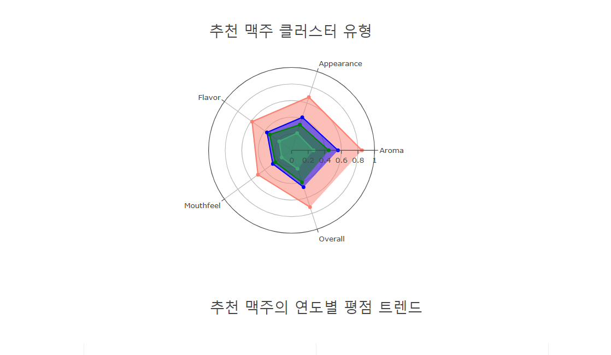

# Clone 코딩 Python Django를 이용한 맥주 추천 서비스 배포 

> 티스토리 / 깃 허브 ghgit1798님 파일 참조 
> https://github.com/ghgit1798
><br>  https://western-sky.tistory.com/

----
* 메인 창 


---
* 취향에 따른 맥주 선호도<br>


----

* 맥주 추천 서비스 <br>

---
* 맥주 클러스터링 시각화 <br>

-----
* 추천 맥주의 연도별 평점 트렌드 <br>


---- 

## 소스코드 맛보기 
```python
def crawl(driver, beer, data, k):
    # 데이터 프레임 생성
    data = pd.DataFrame(data=[], columns=['맥주정보', '검색이름', '맥주이름'])

    # url open
    print('url_open... {0} 맥주 데이터를 수집합니다..'.format(beer))
    driver = webdriver.Chrome(chromedriver)
    driver.get(url)
    driver.set_window_size(900, 900)

    # 1번 사진에 해당 : 맥주 검색
    time.sleep(2)
    element = driver.find_element_by_xpath('//*[@id="root"]/div[2]/header/div[2]/div[1]/div[2]/div/div/input')
    time.sleep(2)
    element.click()
    time.sleep(2)
    element.send_keys(beer)
    time.sleep(3)

    # 2번 사진에 해당 : 상품 선택
    driver.find_element_by_xpath('//*[@id="root"]/div[2]/header/div[2]/div[1]/div[2]/div/div[2]/a[1]/div/div[2]').click()

    # 3번 사진에 해당 : 상품 이름 수집
    time.sleep(3)
    beer_name = driver.find_element_by_css_selector('.MuiTypography-root.Text___StyledTypographyTypeless-bukSfn.pzIrn.text-500.colorized__WrappedComponent-hrwcZr.hwjOn.mt-3.MuiTypography-h4').text

    error_cnt = 0

    while 1:
        try :
            # 4번 사진에 해당 : 전체 리뷰 개수 수집
            time.sleep(3)
            string = driver.find_element_by_class_name('MuiTypography-root.Text___StyledTypographyTypeless-bukSfn.pzIrn.text-500.colorized__WrappedComponent-hrwcZr.hwjOn.MuiTypography-h6').text

            # ,가 포함되어 있는지에 대한 로직
            extract = re.compile('[0-9]*,*[0-9]+')
            str_num = extract.findall(string)
            str_num = str_num[0]

            print('성공... while문을 탈출합니다.')
            break
        except :
            print('오류 발생.. 다시 시작합니다.')

            error_cnt += 1

            if error_cnt == 5:
                print('연속된 오류로 다음 맥주로 넘어갑니다...')
                return

    if ',' in str_num:
        str_num = str_num.split(',')
        str_num = int(str_num[0]+str_num[1])
        num = str_num
    else:
        num = int(str_num)

    # 5번 사진에 해당 : Score breakdown 클릭
    time.sleep(3)
    element = driver.find_element_by_xpath('//*[@id="root"]/div[2]/div[2]/div/div/div/div[2]/div[4]/div/div[2]/div[1]/div[2]')
    time.sleep(3)
    # 해당 element로 이동하는 코드입니다. 반드시 적어주세요.
    driver.execute_script("arguments[0].click();", element)

    # 수집할 Page 수를 계산합니다.
    page_num = num // 15 + 1


    for i in range(page_num):
        print(i+1, '번째 페이지입니다.')

        # 6번 사진에 해당 : 전체 맥주 정보를 통째로 수집
        time.sleep(3)
        beer_info = driver.find_elements_by_css_selector('.px-4.fj-s.f-wrap')

        tmp = []

        # 수집한 것을 데이터프레임에 저장
        for i in range(len(beer_info)):
            tmp.append(beer_info[i].text)

        tmp = pd.DataFrame(data=tmp, columns=['맥주정보'])
        tmp['맥주이름'] = beer_name
        tmp['검색이름'] = beer
        data = pd.concat([data, tmp])

        # 다음 페이지로 넘어가기 : 7번 사진에 해당합니다.
        # div, span, title 태그 후 속성은 class 외에도 사용 가능
        try :
            element = driver.find_element_by_xpath('//button[@title="Next page"]/span[@class="MuiIconButton-label"]')
            time.sleep(3)
            driver.execute_script("arguments[0].click();", element)
        except:
            print('마지막 페이지입니다.')

    # 데이터가 중복 수집될 경우 리뷰 수 만큼만 Cut
    if num != len(data):
        data = data[:num]

    print('리뷰수 : ', num, '수집된 리뷰수 : ', len(data))

    # 데이터를 csv, excel 파일로 저장합니다.
    result = pd.merge(data, beer_list, on='검색이름', how='left')
    result.to_csv("beer_n_"+str(k)+".csv", encoding='utf-8')
    result.to_excel("beer_n_"+str(k)+".xlsx")

    driver.quit()

    return result
```
--- 
* 정리내용 
> 셀레니움 이용한 크롤링 → 정제 → 클러스터링 → 코사인 유사도를 이용한 추천 시스템 탑재 → 장고 활성화
